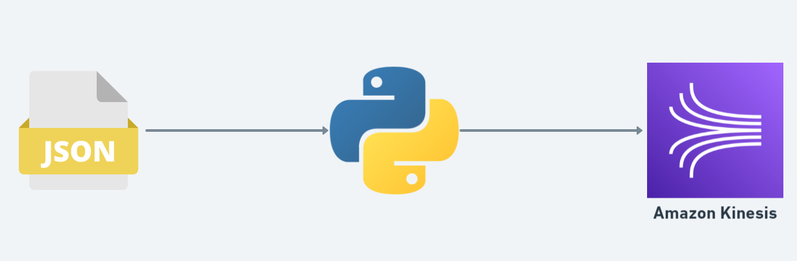

# Real-Time Data Streaming to Amazon Kinesis

This project demonstrates real-time data streaming from a JSON file to an Amazon Kinesis Data Stream using a Python script. The script reads data from a JSON file, processes it, and sends it to a specified Kinesis Data Stream at regular intervals.

## Work Flow


## Features
- **Real-Time Data Streaming:** Continuously sends data to Amazon Kinesis in real-time.
- **JSON Data Handling:** Reads and processes data from a JSON file.
- **Partition Key Determination:** Uses a specific field (species) to determine the partition key for Kinesis.
- **Configurable Parameters:** Allows configuration of the Kinesis stream name and time interval between writes.


## Prerequisites
- **AWS Account:** An AWS account with permissions to create and manage Kinesis Data Streams.
- **Python:** Python 3.x installed on your machine.
- **AWS CLI:** AWS Command Line Interface (CLI) configured with your credentials.

## Installation

- **Clone the Repository:**

```
git clone https://github.com/Komalsai234/Stream-Data-from-CSV-File-to-AWS-Kinesis.git
```

- **Install Dependencies:**

```
pip install boto3
```
- **Setup AWS Credentials:**

    - Ensure your AWS CLI is configured with the necessary permissions. You can configure the CLI using:


            aws configure

## Usage
To run the script, use the following command:

```
python send_to_kinesis.py --stream_name <YOUR_STREAM_NAME> --interval <INTERVAL_IN_SECONDS>
```


    **--stream_name:** The name of your Kinesis Data Stream.
    
    **--interval:** The time interval (in seconds) between two writes to the Kinesis stream.
